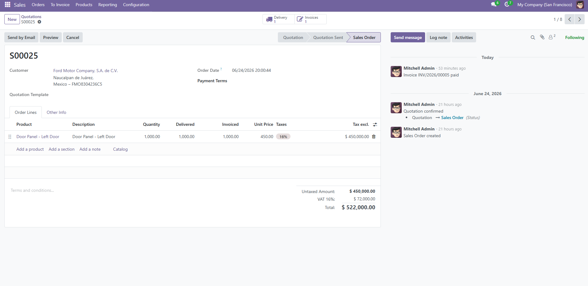

# AxleCore ERP



A local ERP environment built with Odoo 17 and PostgreSQL 15, orchestrated with Docker Compose. Built as a learning exercise to explore ERP systems in the context of an automotive stamping company called **AxleCore**.

---

## What I Learned

- How to set up a multi-container environment with Docker Compose
- How Odoo modules work (Sales, Purchase, Inventory, Manufacturing)
- The full ERP business cycle from customer order to payment
- How Odoo stores data in PostgreSQL and how to query it directly with SQL
- How an ERP can be evaluated and shaped for a specific industry

---

## Features

- 🏭 **Manufacturing** — Production orders and Bills of Materials
- 📦 **Inventory** — Raw material and finished goods tracking
- 🛒 **Purchase** — Supplier orders and material receiving
- 💼 **Sales** — Customer quotations and order management
- 🧾 **Invoicing** — Automatic invoice generation with IVA (16%)
- 🔧 **Maintenance** — Press machine maintenance tracking
- 🗄️ **PostgreSQL** — Direct SQL access to all ERP data

---

## Full ERP Cycle Walkthrough

This project walks through a complete real-world business transaction:

1. **Sales Order** — Ford Motor Company orders 1,000 door panels
2. **Purchase Order** — Buy Steel Coil from supplier
3. **Receipt** — Raw materials arrive and enter inventory
4. **Manufacturing Order** — 1,000 door panels produced using BOM
5. **Delivery** — Finished goods shipped to Ford
6. **Invoice** — $522,000 MXN billed automatically with 16% IVA
7. **Payment** — Invoice marked as paid

---

## SQL Queries

Querying the live Odoo database directly with PostgreSQL:

```sql
-- View sales orders
SELECT name, state, amount_total
FROM sale_order
ORDER BY id DESC LIMIT 5;

-- View order lines
SELECT so.name, sol.name, sol.product_uom_qty, sol.price_unit, sol.price_total
FROM sale_order so
JOIN sale_order_line sol ON sol.order_id = so.id
WHERE so.name = 'S00025';

-- View manufacturing orders
SELECT name, state, product_qty
FROM mrp_production
ORDER BY id DESC LIMIT 3;
```

---

## Prerequisites

- Docker Desktop installed and running

---

## How to Run

1. Clone this repository
2. Open a terminal in the project folder
3. Run:

```bash
docker compose up -d
```

4. Open your browser and go to `http://localhost:8069`

---

## To Stop

```bash
docker compose down
```

All data persists between sessions via Docker volumes.

---

## Tech Stack

- Odoo 17 Community Edition
- PostgreSQL 15
- Docker Compose

---

## What's Next

- [ ] Deploy to AWS EC2 so the ERP is accessible over the internet
- [ ] Evaluate Odoo customization for stamping-specific needs (press scheduling, steel coil tracking, scrap rates)
- [ ] Build custom Odoo module for automotive part numbering
- [ ] Connect PostgreSQL data to a reporting layer (DuckDB + pandas)
- [ ] Add Maintenance module workflows for press machines

---

## Author

Tarek — Data Analyst transitioning into Data Engineering & ERP Development
